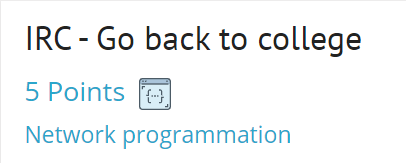
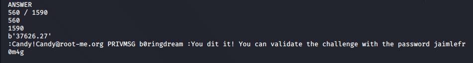

# IRC task - 5 Points



## Условия задания :

```
 * You must calculate the square root of the number n°1 and multiply the result by the number n°2.
 * Then you need to round to two decimals.
 * You have 2 seconds to send the correct answer from the time the bot gets the message !ep1
 * If the bot does not respond, then you have been banned. Just wait a few minutes.
 * The answer must be sent as  `!ep1 -rep <answer>.`
```
## Решение и зависимости : 

Сам скрипт [SCRIPT](./Task%20exploit/IRC-Go-back-to-colledge.py)

Модули для python:
* pwn
* time

