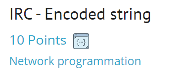
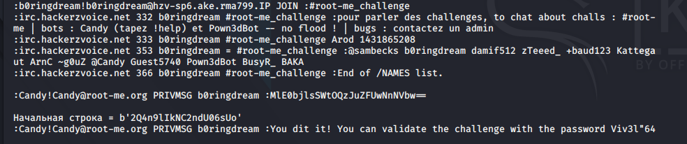

# IRC task - 10 Points



## Условия задания :

```
* The bot answer you by a private message.
* This is a series of encoded characters.
* You must send him the decoded message.
* You have 2 seconds.
* If the bot does not respond, then you have been banned. Just wait a few minutes.
* The answer must be sent as : !ep2 -rep <answer>.
```
## Решение и зависимости : 

Сам скрипт [SCRIPT](./Task%20exploit/IRC_Encoded_string.py)

Модули для python:
* pwn
* time
* base64
* re

