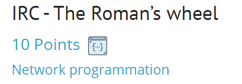
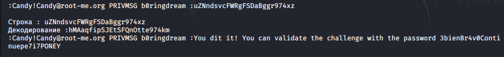

# IRC task - 10 Points



## Условия задания :

```
* The bot answer you by a private message.
* This is an encoded string with ROT13.
* You must send him the message decoded.
* You have 2 second.
* If the bot does not respond, then you have been banned. Just wait a few minutes.
* The answer must be sent as : !ep3 -rep <reponse>
```
## Решение и зависимости : 

Сам скрипт [SCRIPT](./Task%20exploit/IRC_The_Romans_wheel.py)

Модули для python:
* pwn
* time
* codecs
* re

