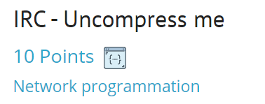
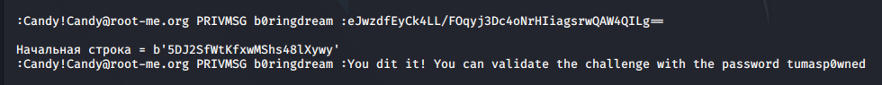

# IRC task -10 Points



## Условия задания :

```
* The bot answer you by a private message.
* This is a string compressed with zlib and encoded with base64.
* You must send him the original message.
* You have 2 seconds.
* If the bot does not respond, then you have been banned. Just wait a few minutes.
* The answer must be sent as : !ep4 -rep <reponse>
```

## Решение и зависимости : 

Сам скрипт [SCRIPT](./Task%20exploit/IRC_Uncompress_me.py)

Модули для python:
* pwn
* time
* base64
* zlib
* re

