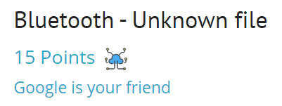
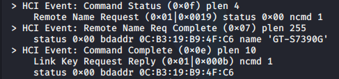
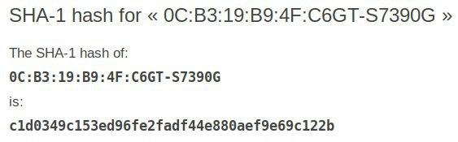

## Задание
Your friend working at NSA recovered an unreadable file in a hacker’s computer. The only thing he knows is that it comes from a communication between a computer and a phone.
The answer is the sha-1 hash of the concatenation of the MAC address (uppercase) and the name of the phone.

## Решение
Загружаем файл [ch2.pcap](./load_file/ch18.pcap)

Для просмотра трафика будет использован инструмен `hcidump` - утилита, которая позволяет наблюдать за активностью устройств Bluetooth.

Для отображения типа файла используем  `file ch18.bin` --> `ch18.bin: BTSnoop version 1, HCI UART (H4)`

Запускаем команду `hcidump -r ch18.bin`, которая выведет всю информацию в файле.

<details>
  <summary>Полный вывод команды</summary>	

```
HCI sniffer - Bluetooth packet analyzer ver 5.50
btsnoop version: 1 datalink type: 1002
> HCI Event: Connect Request (0x04) plen 10
    bdaddr 0C:B3:19:B9:4F:C6 class 0x5a020c type ACL
> HCI Event: Command Status (0x0f) plen 4
    Accept Connection Request (0x01|0x0009) status 0x00 ncmd 1
> HCI Event: Connect Complete (0x03) plen 11
    status 0x00 handle 256 bdaddr 0C:B3:19:B9:4F:C6 type ACL encrypt 0x00
> HCI Event: Command Status (0x0f) plen 4
    Read Remote Supported Features (0x01|0x001b) status 0x00 ncmd 1
> HCI Event: Read Remote Supported Features (0x0b) plen 11
    status 0x00 handle 256
    Features: 0xbf 0xfe 0xcf 0xfe 0xdb 0xff 0x7b 0x87
> HCI Event: Command Status (0x0f) plen 4
    Read Remote Extended Features (0x01|0x001c) status 0x00 ncmd 1
> HCI Event: Read Remote Extended Features (0x23) plen 13
    status 0x00 handle 256 page 1 max 1
    Features: 0x07 0x00 0x00 0x00 0x00 0x00 0x00 0x00
> HCI Event: Command Status (0x0f) plen 4
    Remote Name Request (0x01|0x0019) status 0x00 ncmd 1
> HCI Event: Remote Name Req Complete (0x07) plen 255
    status 0x00 bdaddr 0C:B3:19:B9:4F:C6 name 'GT-S7390G'
> HCI Event: Command Complete (0x0e) plen 10
    IO Capability Request Reply (0x01|0x002b) ncmd 1
    status 0x00 bdaddr 0C:B3:19:B9:4F:C6
> HCI Event: Command Complete (0x0e) plen 10
    User Confirmation Request Reply (0x01|0x002c) ncmd 1
    status 0x00 bdaddr 0C:B3:19:B9:4F:C6
> HCI Event: Encrypt Change (0x08) plen 4
    status 0x00 handle 256 encrypt 0x01
> HCI Event: Disconn Complete (0x05) plen 4
    status 0x00 handle 256 reason 0x13
    Reason: Remote User Terminated Connection
> HCI Event: Connect Request (0x04) plen 10
    bdaddr 0C:B3:19:B9:4F:C6 class 0x5a020c type ACL
> HCI Event: Command Status (0x0f) plen 4
    Accept Connection Request (0x01|0x0009) status 0x00 ncmd 1
> HCI Event: Connect Complete (0x03) plen 11
    status 0x00 handle 256 bdaddr 0C:B3:19:B9:4F:C6 type ACL encrypt 0x00
> HCI Event: Command Status (0x0f) plen 4
    Read Remote Supported Features (0x01|0x001b) status 0x00 ncmd 1
> HCI Event: Read Remote Supported Features (0x0b) plen 11
    status 0x00 handle 256
    Features: 0xbf 0xfe 0xcf 0xfe 0xdb 0xff 0x7b 0x87
> HCI Event: Command Status (0x0f) plen 4
    Read Remote Extended Features (0x01|0x001c) status 0x00 ncmd 1
> HCI Event: Read Remote Extended Features (0x23) plen 13
    status 0x00 handle 256 page 1 max 1
    Features: 0x07 0x00 0x00 0x00 0x00 0x00 0x00 0x00
> HCI Event: Command Status (0x0f) plen 4
    Remote Name Request (0x01|0x0019) status 0x00 ncmd 1
> HCI Event: Remote Name Req Complete (0x07) plen 255
    status 0x00 bdaddr 0C:B3:19:B9:4F:C6 name 'GT-S7390G'
> HCI Event: Command Complete (0x0e) plen 10
    Link Key Request Reply (0x01|0x000b) ncmd 1
    status 0x00 bdaddr 0C:B3:19:B9:4F:C6
> HCI Event: Encrypt Change (0x08) plen 4
    status 0x00 handle 256 encrypt 0x01
> HCI Event: Command Complete (0x0e) plen 4
    Set AFH Host Channel Classification (0x03|0x003f) ncmd 2
    status 0x00
> HCI Event: Command Complete (0x0e) plen 4
    Set AFH Host Channel Classification (0x03|0x003f) ncmd 2
    status 0x00
> HCI Event: Disconn Complete (0x05) plen 4
    status 0x00 handle 256 reason 0x13
    Reason: Remote User Terminated Connection
```
</details>




Воспользуемся онлайн сервисом - [link](https://sha1.gromweb.com) и получим флаг



***Flag*** -  `c1d0349c153ed96fe2fadf44e880aef9e69c122b`


