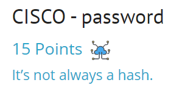

## Задание
Find the "Enable" password.

## Решение
Доступные данные для задания [file](./load_file/cisco.txt)

Самые важные:
```
security passwords min-length 8
no logging console
enable secret 5 $1$p8Y6$MCdRLBzuGlfOs9S.hXOp0.
!
username hub password 7 025017705B3907344E 
username admin privilege 15 password 7 10181A325528130F010D24
username guest password 7 124F163C42340B112F3830
```

Попробуем расшифровать пароли с помощью [Cisco Password Cracker](https://www.ifm.net.nz/cookbooks/passwordcracker.html)

```
144101205C3B29242A3B3C3927 > 6sK0_console
025017705B3907344E > 6sK0_hub
10181A325528130F010D24 > 6sK0_admin	
124F163C42340B112F3830 > 6sK0_guest
```

По логики пробуем ввести флаг с  `_enable`

***Flag*** - `6sK0_enable`