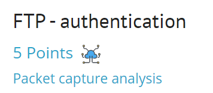
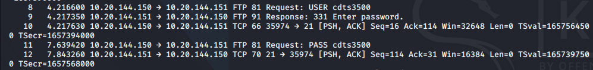

## Задание
An authenticated file exchange achieved through FTP. Recover the password used by the user.

## Решение
Загружаем файл [ch1.pcap](load_file/ch1.pcap)

Для чтения трафика будет использован инструмен `tshark`

`tshark -r ch1.pcap` 

<details>
  <summary>Вывод комманды</summary>	

```
1   0.000000 10.20.144.150 → 10.20.144.151 TCP 74 35974 → 21 [SYN] Seq=0 Win=32648 Len=0 MSS=1380 WS=1 TSval=1657560000 TSecr=0
    2   0.000320 10.20.144.151 → 10.20.144.150 TCP 78 21 → 35974 [SYN, ACK] Seq=0 Ack=1 Win=16384 Len=0 MSS=1356 WS=1 TSval=1657390000 TSecr=1657560000
    3   0.000570 10.20.144.150 → 10.20.144.151 TCP 66 35974 → 21 [ACK] Seq=1 Ack=1 Win=32648 Len=0 TSval=1657560000 TSecr=1657390000
    4   0.060630 10.20.144.151 → 10.20.144.150 FTP 106 Response: 220-QTCP at fran.csg.stercomm.com.
    5   0.275440 10.20.144.150 → 10.20.144.151 TCP 66 35974 → 21 [ACK] Seq=1 Ack=37 Win=32648 Len=0 TSval=1657560500 TSecr=1657390000
    6   0.275760 10.20.144.151 → 10.20.144.150 FTP 126 Response: 220 Connection will close if idle more than 5 minutes.
    7   0.276140 10.20.144.150 → 10.20.144.151 TCP 66 35974 → 21 [ACK] Seq=1 Ack=93 Win=32648 Len=0 TSval=1657560500 TSecr=1657390000
    8   4.216600 10.20.144.150 → 10.20.144.151 FTP 81 Request: USER cdts3500
    9   4.217350 10.20.144.151 → 10.20.144.150 FTP 91 Response: 331 Enter password.
   10   4.217630 10.20.144.150 → 10.20.144.151 TCP 66 35974 → 21 [PSH, ACK] Seq=16 Ack=114 Win=32648 Len=0 TSval=1657564500 TSecr=1657394000
   11   7.639420 10.20.144.150 → 10.20.144.151 FTP 81 Request: PASS cdts3500
   12   7.843260 10.20.144.151 → 10.20.144.150 TCP 70 21 → 35974 [PSH, ACK] Seq=114 Ack=31 Win=16384 Len=0 TSval=1657397500 TSecr=1657568000
   13   8.184000 10.20.144.151 → 10.20.144.150 FTP 95 Response: 230 CDTS3500 logged on.
   14   8.184360 10.20.144.150 → 10.20.144.151 TCP 66 35974 → 21 [PSH, ACK] Seq=31 Ack=139 Win=32648 Len=0 TSval=1657568500 TSecr=1657398000
   15   8.185040 10.20.144.150 → 10.20.144.151 FTP 72 Request: SYST
   16   8.185260 10.20.144.151 → 10.20.144.150 TCP 70 21 → 35974 [PSH, ACK] Seq=139 Ack=37 Win=16384 Len=0 TSval=1657398000 TSecr=1657568500
   17   8.192750 10.20.144.151 → 10.20.144.150 FTP 147 Response: 215  OS/400 is the remote operating system. The TCP/IP version is "V5R2M0".
   18   8.193000 10.20.144.150 → 10.20.144.151 TCP 66 35974 → 21 [PSH, ACK] Seq=37 Ack=216 Win=32648 Len=0 TSval=1657568500 TSecr=1657398000
   19   8.193570 10.20.144.150 → 10.20.144.151 FTP 80 Request: SITE NAMEFMT
   20   8.193780 10.20.144.151 → 10.20.144.150 TCP 70 21 → 35974 [PSH, ACK] Seq=216 Ack=51 Win=16384 Len=0 TSval=1657398000 TSecr=1657568500
   21   8.194900 10.20.144.151 → 10.20.144.150 FTP 105 Response: 250  Now using naming format "0".
   22   8.195140 10.20.144.150 → 10.20.144.151 TCP 66 35974 → 21 [PSH, ACK] Seq=51 Ack=251 Win=32648 Len=0 TSval=1657568500 TSecr=1657398000
   23   8.195700 10.20.144.150 → 10.20.144.151 FTP 71 Request: PWD
   24   8.195910 10.20.144.151 → 10.20.144.150 TCP 70 21 → 35974 [PSH, ACK] Seq=251 Ack=56 Win=16384 Len=0 TSval=1657398000 TSecr=1657568500
   25   8.197050 10.20.144.151 → 10.20.144.150 FTP 106 Response: 257 "CDTS3500" is current library.
   26   8.197280 10.20.144.150 → 10.20.144.151 TCP 66 35974 → 21 [PSH, ACK] Seq=56 Ack=287 Win=32648 Len=0 TSval=1657568500 TSecr=1657398000
   27  20.765720 10.20.144.150 → 10.20.144.151 FTP 72 Request: PASV
   28  20.766000 10.20.144.151 → 10.20.144.150 TCP 70 21 → 35974 [PSH, ACK] Seq=287 Ack=62 Win=16384 Len=0 TSval=1657410500 TSecr=1657581000
   29  20.787770 10.20.144.151 → 10.20.144.150 FTP 121 Response: 227 Entering Passive Mode (10,20,144,151,62,141).
   30  20.788010 10.20.144.150 → 10.20.144.151 TCP 66 35974 → 21 [PSH, ACK] Seq=62 Ack=338 Win=32648 Len=0 TSval=1657581000 TSecr=1657410500
   31  20.797560 10.20.144.150 → 10.20.144.151 TCP 74 35976 → 16013 [SYN] Seq=0 Win=32768 Len=0 MSS=1380 WS=1 TSval=1657581000 TSecr=0
   32  20.797850 10.20.144.151 → 10.20.144.150 TCP 78 16013 → 35976 [SYN, ACK] Seq=0 Ack=1 Win=32768 Len=0 MSS=1356 WS=1 TSval=1657410500 TSecr=1657581000
   33  20.798130 10.20.144.150 → 10.20.144.151 TCP 66 35976 → 16013 [ACK] Seq=1 Ack=1 Win=32768 Len=0 TSval=1657581000 TSecr=1657410500
   34  20.798250 10.20.144.150 → 10.20.144.151 FTP 91 Request: RETR qgpl/apkeyf.apkeyf
   35  20.798450 10.20.144.151 → 10.20.144.150 TCP 70 21 → 35974 [PSH, ACK] Seq=338 Ack=87 Win=16384 Len=0 TSval=1657410500 TSecr=1657581000
   36  21.202190 10.20.144.151 → 10.20.144.150 FTP 132 Response: 150 Retrieving member APKEYF in file APKEYF in library QGPL.
   37  21.202460 10.20.144.150 → 10.20.144.151 TCP 66 35974 → 21 [PSH, ACK] Seq=87 Ack=400 Win=32648 Len=0 TSval=1657581500 TSecr=1657411000
   38  21.313290 10.20.144.151 → 10.20.144.150 FTP-DATA 509 FTP Data: 439 bytes (PASV) (RETR qgpl/apkeyf.apkeyf)
   39  21.393980 10.20.144.151 → 10.20.144.150 TCP 70 16013 → 35976 [FIN, PSH, ACK] Seq=440 Ack=1 Win=32768 Len=0 TSval=1657411500 TSecr=1657581000
   40  21.394160 10.20.144.151 → 10.20.144.150 FTP 113 Response: 250 File transfer completed successfully.
   41  21.394310 10.20.144.150 → 10.20.144.151 TCP 66 35976 → 16013 [ACK] Seq=1 Ack=441 Win=32768 Len=0 TSval=1657581500 TSecr=1657411500
   42  21.394430 10.20.144.150 → 10.20.144.151 TCP 66 35974 → 21 [PSH, ACK] Seq=87 Ack=443 Win=32648 Len=0 TSval=1657581500 TSecr=1657411500
   43  22.169470 10.20.144.150 → 10.20.144.151 TCP 66 35976 → 16013 [FIN, PSH, ACK] Seq=1 Ack=441 Win=32768 Len=0 TSval=1657582500 TSecr=1657411500
   44  22.169800 10.20.144.151 → 10.20.144.150 TCP 70 16013 → 35976 [PSH, ACK] Seq=441 Ack=2 Win=32768 Len=0 TSval=1657412000 TSecr=1657582500
   45  31.007220 10.20.144.150 → 10.20.144.151 FTP 72 Request: QUIT
   46  31.007560 10.20.144.151 → 10.20.144.150 TCP 70 21 → 35974 [PSH, ACK] Seq=443 Ack=93 Win=16384 Len=0 TSval=1657421000 TSecr=1657591500
   47  31.007750 10.20.144.151 → 10.20.144.150 FTP 101 Response: 221 QUIT subcommand received.
   48  31.007830 10.20.144.151 → 10.20.144.150 TCP 70 21 → 35974 [FIN, PSH, ACK] Seq=474 Ack=93 Win=16384 Len=0 TSval=1657421000 TSecr=1657591500
   49  31.008000 10.20.144.150 → 10.20.144.151 TCP 66 35974 → 21 [PSH, ACK] Seq=93 Ack=474 Win=32648 Len=0 TSval=1657591500 TSecr=1657421000
   50  31.008810 10.20.144.150 → 10.20.144.151 TCP 66 35974 → 21 [FIN, PSH, ACK] Seq=93 Ack=474 Win=32648 Len=0 TSval=1657591500 TSecr=1657421000
   51  31.008840 10.20.144.150 → 10.20.144.151 TCP 66 35974 → 21 [PSH, ACK] Seq=94 Ack=475 Win=32648 Len=0 TSval=1657591500 TSecr=1657421000
   52  31.009050 10.20.144.151 → 10.20.144.150 TCP 70 21 → 35974 [PSH, ACK] Seq=475 Ack=94 Win=16384 Len=0 TSval=1657421000 TSecr=1657591500
   53  35.659010 10.20.144.150 → 10.20.144.151 TCP 74 35977 → 23 [SYN] Seq=0 Win=32648 Len=0 MSS=1380 WS=1 TSval=1657596000 TSecr=0
   54  35.659340 10.20.144.151 → 10.20.144.150 TCP 78 23 → 35977 [SYN, ACK] Seq=0 Ack=1 Win=16384 Len=0 MSS=1356 WS=1 TSval=1657425500 TSecr=1657596000
   55  35.659660 10.20.144.150 → 10.20.144.151 TCP 66 35977 → 23 [ACK] Seq=1 Ack=1 Win=32648 Len=0 TSval=1657596000 TSecr=1657425500
   56  35.660510 10.20.144.151 → 10.20.144.150 TELNET 76 Telnet Data ...
   57  35.713440 10.20.144.150 → 10.20.144.151 TELNET 69 Telnet Data ...
   58  35.713670 10.20.144.151 → 10.20.144.150 TELNET 76 Telnet Data ...
   59  35.740240 10.20.144.150 → 10.20.144.151 TELNET 69 Telnet Data ...
   60  35.740480 10.20.144.151 → 10.20.144.150 TELNET 95 Telnet Data ...
   61  35.740750 10.20.144.150 → 10.20.144.151 TELNET 82 Telnet Data ...
   62  35.740960 10.20.144.151 → 10.20.144.150 TELNET 82 Telnet Data ...
   63  35.741210 10.20.144.150 → 10.20.144.151 TCP 66 35977 → 23 [PSH, ACK] Seq=23 Ack=50 Win=32648 Len=0 TSval=1657596000 TSecr=1657426000
   64  35.741580 10.20.144.150 → 10.20.144.151 TELNET 108 Telnet Data ...
   65  35.945290 10.20.144.151 → 10.20.144.150 TCP 70 23 → 35977 [PSH, ACK] Seq=50 Ack=65 Win=16384 Len=0 TSval=1657426000 TSecr=1657596000
   66  35.945610 10.20.144.150 → 10.20.144.151 TELNET 78 Telnet Data ...
   67  35.945810 10.20.144.151 → 10.20.144.150 TCP 70 23 → 35977 [PSH, ACK] Seq=50 Ack=77 Win=16384 Len=0 TSval=1657426000 TSecr=1657596500
   68  36.350870 10.20.144.151 → 10.20.144.150 TN5250 145 TN5250 Data from Mainframe
   69  37.136450 10.20.144.150 → 10.20.144.151 TCP 66 35977 → 23 [PSH, ACK] Seq=77 Ack=125 Win=32648 Len=0 TSval=1657597000 TSecr=1657426500
   70  37.140450 10.20.144.151 → 10.20.144.150 TN5250 573 TN5250 Data from Mainframe
   71  37.143150 10.20.144.150 → 10.20.144.151 TCP 66 35977 → 23 [PSH, ACK] Seq=77 Ack=628 Win=32648 Len=0 TSval=1657597000 TSecr=1657426500
   72  41.737360 10.20.144.150 → 10.20.144.151 TN5250 100 TN5250 Data to Mainframe
   73  41.737640 10.20.144.151 → 10.20.144.150 TCP 70 23 → 35977 [PSH, ACK] Seq=628 Ack=111 Win=16384 Len=0 TSval=1657432000 TSecr=1657602000
   74  41.964780 10.20.144.151 → 10.20.144.150 TN5250 89 TN5250 Data from Mainframe
   75  41.965040 10.20.144.150 → 10.20.144.151 TCP 66 35977 → 23 [PSH, ACK] Seq=111 Ack=647 Win=32648 Len=0 TSval=1657602500 TSecr=1657432000
   76  42.075290 10.20.144.150 → 10.20.144.151 TN5250 139 TN5250 Data to Mainframe
   77  42.075500 10.20.144.151 → 10.20.144.150 TCP 70 23 → 35977 [PSH, ACK] Seq=647 Ack=184 Win=16384 Len=0 TSval=1657432000 TSecr=1657602500
   78  42.076210 10.20.144.151 → 10.20.144.150 TN5250 82 TN5250 Data from Mainframe
   79  42.076530 10.20.144.150 → 10.20.144.151 TCP 66 35977 → 23 [PSH, ACK] Seq=184 Ack=659 Win=32648 Len=0 TSval=1657602500 TSecr=1657432000
   80  42.156700 10.20.144.151 → 10.20.144.150 TN5250 157 TN5250 Data from Mainframe
   81  42.156960 10.20.144.150 → 10.20.144.151 TCP 66 35977 → 23 [PSH, ACK] Seq=184 Ack=746 Win=32648 Len=0 TSval=1657602500 TSecr=1657432500
   82  42.179050 10.20.144.151 → 10.20.144.150 TN5250 233 TN5250 Data from Mainframe
   83  42.179310 10.20.144.150 → 10.20.144.151 TCP 66 35977 → 23 [PSH, ACK] Seq=184 Ack=909 Win=32648 Len=0 TSval=1657602500 TSecr=1657432500
   84  42.179570 10.20.144.151 → 10.20.144.150 TN5250 152 TN5250 Data from Mainframe
   85  42.179830 10.20.144.150 → 10.20.144.151 TCP 66 35977 → 23 [PSH, ACK] Seq=184 Ack=991 Win=32648 Len=0 TSval=1657602500 TSecr=1657432500
   86  43.279170 10.20.144.150 → 10.20.144.151 TN5250 81 TN5250 Data to Mainframe
   87  43.279500 10.20.144.151 → 10.20.144.150 TCP 70 23 → 35977 [PSH, ACK] Seq=991 Ack=199 Win=16384 Len=0 TSval=1657433500 TSecr=1657604000
   88  43.326260 10.20.144.151 → 10.20.144.150 TN5250 84 TN5250 Data from Mainframe
   89  43.326500 10.20.144.150 → 10.20.144.151 TCP 66 35977 → 23 [PSH, ACK] Seq=199 Ack=1005 Win=32648 Len=0 TSval=1657604000 TSecr=1657433500
   90  43.334860 10.20.144.151 → 10.20.144.150 TN5250 812 TN5250 Data from Mainframe
   91  43.335150 10.20.144.150 → 10.20.144.151 TCP 66 35977 → 23 [PSH, ACK] Seq=199 Ack=1747 Win=32648 Len=0 TSval=1657604000 TSecr=1657433500
   92  46.018550 10.20.144.150 → 10.20.144.151 TN5250 93 TN5250 Data to Mainframe
   93  46.018860 10.20.144.151 → 10.20.144.150 TCP 70 23 → 35977 [PSH, ACK] Seq=1747 Ack=226 Win=16384 Len=0 TSval=1657436000 TSecr=1657606500
   94  47.763420 10.20.144.151 → 10.20.144.150 TCP 1426 Telnet Data ... [TCP segment of a reassembled PDU]
   95  47.763550 10.20.144.151 → 10.20.144.150 TN5250 450 TN5250 Data from Mainframe
   96  47.763900 10.20.144.150 → 10.20.144.151 TCP 66 35977 → 23 [PSH, ACK] Seq=226 Ack=3103 Win=32648 Len=0 TSval=1657608500 TSecr=1657438000
   97  47.764010 10.20.144.150 → 10.20.144.151 TCP 66 35977 → 23 [PSH, ACK] Seq=226 Ack=3483 Win=32648 Len=0 TSval=1657608500 TSecr=1657438000
   98  49.806640 10.20.144.150 → 10.20.144.151 TN5250 81 TN5250 Data to Mainframe
   99  49.806870 10.20.144.151 → 10.20.144.150 TCP 70 23 → 35977 [PSH, ACK] Seq=3483 Ack=241 Win=16384 Len=0 TSval=1657440000 TSecr=1657610500
  100  49.825890 10.20.144.151 → 10.20.144.150 TN5250 729 TN5250 Data from Mainframe
  101  49.826140 10.20.144.150 → 10.20.144.151 TCP 66 35977 → 23 [PSH, ACK] Seq=241 Ack=4142 Win=32648 Len=0 TSval=1657610500 TSecr=1657440000
  102  53.784480 10.20.144.150 → 10.20.144.151 TCP 66 35977 → 23 [FIN, PSH, ACK] Seq=241 Ack=4142 Win=32648 Len=0 TSval=1657614500 TSecr=1657440000
  103  53.784750 10.20.144.151 → 10.20.144.150 TCP 70 23 → 35977 [PSH, ACK] Seq=4142 Ack=242 Win=16384 Len=0 TSval=1657444000 TSecr=1657614500
  104  53.791460 10.20.144.151 → 10.20.144.150 TCP 70 23 → 35977 [FIN, PSH, ACK] Seq=4142 Ack=242 Win=16384 Len=0 TSval=1657444000 TSecr=1657614500
  105  53.791680 10.20.144.150 → 10.20.144.151 TCP 66 35977 → 23 [PSH, ACK] Seq=242 Ack=4143 Win=32648 Len=0 TSval=1657614500 TSecr=1657444000
```

</details>

Находим 8 Frame -- `8   4.216600 10.20.144.150 → 10.20.144.151 FTP 81 Request: USER cdts3500` и сдаем флаг.



***Flag*** - `cdts3500`