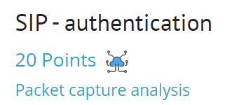
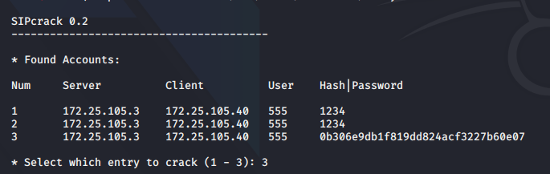

## Задание
Find the password used to authenticate on the SIP infrastructure.

## Решение
Для задания дается txt файл [file](./load_file/sip.txt): 
```
172.25.105.3"172.25.105.40"555"asterisk"REGISTER"sip:172.25.105.40"4787f7ce""""PLAIN"1234
172.25.105.3"172.25.105.40"555"asterisk"INVITE"sip:1000@172.25.105.40"70fbfdae""""MD5"aa533f6efa2b2abac675c1ee6cbde327
172.25.105.3"172.25.105.40"555"asterisk"BYE"sip:1000@172.25.105.40"70fbfdae""""MD5"0b306e9db1f819dd824acf3227b60e07
```
Подробнее про SIP User Authentication [link](https://www.vocal.com/sip-2/sip-user-authentication/)

Сохраняем текст в файл `test.txt` и используем утилиту `sipcrack`. 


Про утилиту `sipcrack` [link](http://manpages.ubuntu.com/manpages/cosmic/man1/sipcrack.1.html)

`sipcrack test.txt -w /usr/share/wordlists/rockyou.txt`
  


***Flag*** - `1234`


