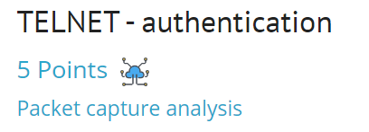
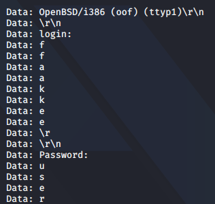

## Задание
Find the user password in this TELNET session capture.


## Решение
Загружаем файл [ch2.pcap](./load_file/ch2.pcap)

Для просмотра трафика будет использован инструмен `tshark`

`tshark -r ch2.pcap  -O "telnet" | grep Data`

<details>
  <summary>Вывод команды</summary>	
  
```
Data: \r\n
    Data: OpenBSD/i386 (oof) (ttyp1)\r\n
    Data: \r\n
    Data: login: 
    Data: f
    Data: f
    Data: a
    Data: a
    Data: k
    Data: k
    Data: e
    Data: e
    Data: \r
    Data: \r\n
    Data: Password:
    Data: u
    Data: s
    Data: e
    Data: r
    Data: \r
    Data: \r\n
    Data: Last login: Thu Dec  2 21:32:59 on ttyp1 from bam.zing.org\r\n
    Data: Warning: no Kerberos tickets issued.\r\n
    Data: OpenBSD 2.6-beta (OOF) #4: Tue Oct 12 20:42:32 CDT 1999\r\n
    Data: \r\n
    Data: Welcome to OpenBSD: The proactively secure Unix-like operating system.\r\n
    Data: \r\n
    Data: Please use the sendbug(1) utility to report bugs in the system.\r\n
    Data: Before reporting a bug, please try to reproduce it with the latest\r\n
    Data: version of the code.  With bug reports, please try to ensure that\r\n
    Data: enough information to reproduce the problem is enclosed, and if a\r\n
    Data: known fix for it exists, include that as well.\r\n
    Data: \r\n
    Data: $ 
    Data: l
    Data: l
    Data: s
    Data: s
    Data: \r
    Data: \r\n
    Data: $ 
    Data: l
    Data: l
    Data: s
    Data: s
    Data:  
    Data:  
    Data: -
    Data: -
    Data: a
    Data: a
    Data: \r
    Data: \r\n
    Data: .         ..        .cshrc    .login    .mailrc   .profile  .rhosts\r\n
    Data: $ 
    Data: /
    Data: /
    Data: s
    Data: s
    Data: b
    Data: b
    Data: i
    Data: i
    Data: n
    Data: n
    Data: /
    Data: /
    Data: p
    Data: p
    Data: i
    Data: i
    Data: n
    Data: n
    Data: g
    Data: g
    Data:  
    Data:  
    Data: w
    Data: w
    Data: w
    Data: w
    Data: w
    Data: w
    Data: .
    Data: .
    Data: y
    Data: y
    Data: a
    Data: a
    Data: h
    Data: h
    Data: o
    Data: o
    Data: o
    Data: o
    Data: .
    Data: .
    Data: c
    Data: c
    Data: o
    Data: o
    Data: m
    Data: m
    Data: \r
    Data: \r\n
    Data: PING www.yahoo.com (204.71.200.74): 56 data bytes\r\n
    Data: 64 bytes from 204.71.200.74: icmp_seq=0 ttl=239 time=73.569 ms\r\n
    Data: 64 bytes from 204.71.200.74: icmp_seq=1 ttl=239 time=71.099 ms\r\n
    Data: 64 bytes from 204.71.200.74: icmp_seq=2 ttl=239 time=68.728 ms\r\n
    Data: 64 bytes from 204.71.200.74: icmp_seq=3 ttl=239 time=73.122 ms\r\n
    Data: 64 bytes from 204.71.200.74: icmp_seq=4 ttl=239 time=71.276 ms\r\n
    Data: 64 bytes from 204.71.200.74: icmp_seq=5 ttl=239 time=75.831 ms\r\n
    Data: 64 bytes from 204.71.200.74: icmp_seq=6 ttl=239 time=70.101 ms\r\n
    Data: 64 bytes from 204.71.200.74: icmp_seq=7 ttl=239 time=74.528 ms\r\n
    Data: 64 bytes from 204.71.200.74: icmp_seq=9 ttl=239 time=74.514 ms\r\n
    Data: 64 bytes from 204.71.200.74: icmp_seq=10 ttl=239 time=75.188 ms\r\n
    Data: 64 bytes from 204.71.200.74: icmp_seq=11 ttl=239 time=72.925 ms\r\n
    Data: \003
    Data: �
    Data: ^C\r
    Data: --- www.yahoo.com ping statistics ---\r\n
    Data: 13 packets transmitted, 11 packets received, 15% packet loss\r\n
    Data: round-trip min/avg/max = 68.728/72.807/75.831 ms\r\n
    Data: $ 
    Data: e
    Data: e
    Data: x
    Data: x
    Data: i
    Data: i
    Data: t
    Data: t
    Data: \r
```
</details>



***Flag*** - `user`