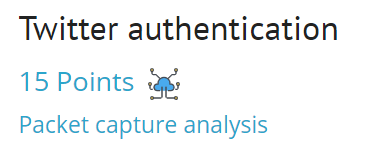
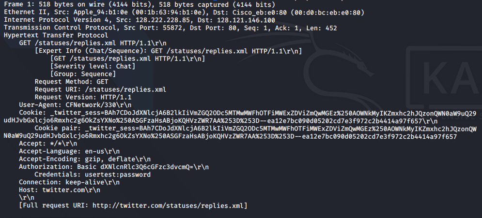

## Задание
A twitter authentication session has been captured, you have to retrieve the password.

## Решение

Загружаем файл [ch3.pcap](./load_file/ch3.pcap)

Для просмотра трафика будет использован инструмен `tshark`

`tshark -r ch3.pcap -O "http"`

Флаг находится в строке  `Credentials:  usertest:password`

***Flag*** - `password` 