# TASK - Boiler CTF
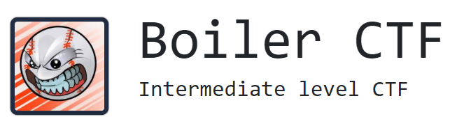


<details>
  <summary>Ответы на вопросы</summary>

[Task 1] Questions #1
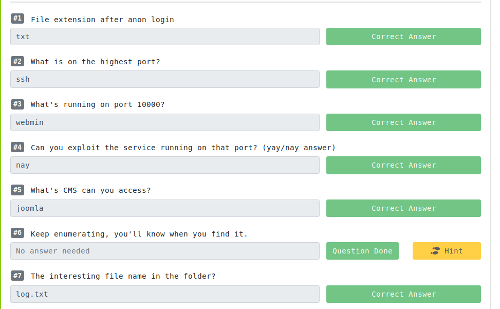
[Task 2] Questions #2
  
</details>   

## User

Для начала необходимо просканить порты : `sudo nmap -sV -p- -T5 -sC -Pn 10.10.211.61` 
```
PORT      STATE SERVICE VERSION
21/tcp    open  ftp     vsftpd 3.0.3
|_ftp-anon: Anonymous FTP login allowed (FTP code 230)
| ftp-syst: 
|   STAT: 
| FTP server status:
|      Connected to ::ffff:10.9.10.151
|      Logged in as ftp
|      TYPE: ASCII
|      No session bandwidth limit
|      Session timeout in seconds is 300
|      Control connection is plain text
|      Data connections will be plain text
|      At session startup, client count was 1
|      vsFTPd 3.0.3 - secure, fast, stable
|_End of status
80/tcp    open  http    Apache httpd 2.4.18 ((Ubuntu))
| http-robots.txt: 1 disallowed entry 
|_/
|_http-server-header: Apache/2.4.18 (Ubuntu)
|_http-title: Apache2 Ubuntu Default Page: It works
10000/tcp open  http    MiniServ 1.930 (Webmin httpd)
|_http-title: Site doesn't have a title (text/html; Charset=iso-8859-1).
/tcp open  ssh     OpenSSH 7.2p2 Ubuntu 4ubuntu2.8 (Ubuntu Linux; protocol 2.0)
| ssh-hostkey: 
|   2048 e3:ab:e1:39:2d:95:eb:13:55:16:d6:ce:8d:f9:11:e5 (RSA)
|   256 ae:de:f2:bb:b7:8a:00:70:20:74:56:76:25:c0:df:38 (ECDSA)
|_  256 25:25:83:f2:a7:75:8a:a0:46:b2:12:70:04:68:5c:cb (ED25519)
Service Info: OSs: Unix, Linux; CPE: cpe:/o:linux:linux_kernel
```
Видим открытые порты 21 - ftp, 80 - http, 10000 - http (Webmin). Узнаем все дирректории с помощью `dirb`

`dirb http://10.10.224.171/`
```
+ http://10.10.224.171/index.html (CODE:200|SIZE:11321)
==> DIRECTORY: http://10.10.224.171/joomla
==> DIRECTORY: http://10.10.224.171/manual/
+ http://10.10.224.171/robots.txt (CODE:200|SIZE:257)
+ http://10.10.224.171/server-status (CODE:403|SIZE:301)
Entering directory: http://10.10.224.171/joomla/
==> DIRECTORY: http://10.10.224.171/joomla/_archive/
==> DIRECTORY: http://10.10.224.171/joomla/_database/
==> DIRECTORY: http://10.10.224.171/joomla/_files/
==> DIRECTORY: http://10.10.224.171/joomla/_test/
==> DIRECTORY: http://10.10.224.171/joomla/~www/
==> DIRECTORY: http://10.10.224.171/joomla/administrator/
==> DIRECTORY: http://10.10.224.171/joomla/bin/
==> DIRECTORY: http://10.10.224.171/joomla/build/
==> DIRECTORY: http://10.10.224.171/joomla/cache/
==> DIRECTORY: http://10.10.224.171/joomla/components/
==> DIRECTORY: http://10.10.224.171/joomla/images/
==> DIRECTORY: http://10.10.224.171/joomla/includes/
+ http://10.10.224.171/joomla/index.php (CODE:200|SIZE:12484)
==> DIRECTORY: http://10.10.224.171/joomla/installation/
==> DIRECTORY: http://10.10.224.171/joomla/language/
==> DIRECTORY: http://10.10.224.171/joomla/layouts/
==> DIRECTORY: http://10.10.224.171/joomla/libraries/
==> DIRECTORY: http://10.10.224.171/joomla/media/
==> DIRECTORY: http://10.10.224.171/joomla/modules/
==> DIRECTORY: http://10.10.224.171/joomla/plugins/
==> DIRECTORY: http://10.10.224.171/joomla/templates/
==> DIRECTORY: http://10.10.224.171/joomla/tests/
==> DIRECTORY: http://10.10.224.171/joomla/tmp/  
```

Узнаем, что CMS сайта - Joomla, но попытка просканить на уязвимости его оказались безуспешными. Скан был проведен с помощью `JoomScan`
```
[+] FireWall Detector
[++] Firewall not detected

[+] Detecting Joomla Version
^[[B^[[B^[[B^[[B^[[B^[[B^[[B^[[B^[[B^[[B^[[B^[[B^[[B^[[B^[[B^[[B^[[B^[[B^[[B^[[B^[[B^[[B^[[B^[[B^[[B^[[B^[[B^[[B^[[B^[[B^[[B^[[B^[[B^[[B^[[B^[[B^[[B^[[B^[[B^[[B^[[B^[[B^[[B^[[B^[[B^[[B^[[B^[[B^[[B^[[B^[[B^[[B^[[B^[[B^[[B^[[B^[[B^[[B^[[B^[[B^[[B^[[B^[[B^[[B^[[B^[[B^[[B^[[B^[[B^[[B^[[B^[[B^[[B^[[B^[[B^[[B^[[B^[[B^[[B^[[B^[[B[++] Joomla 3.9.12dev

[+] Core Joomla Vulnerability
[++] Target Joomla core is not vulnerable
[+] Checking Directory Listing
[++] directory has directory listing :
http://10.10.87.59/joomla/administrator/components
http://10.10.87.59/joomla/administrator/modules
http://10.10.87.59/joomla/administrator/templates
http://10.10.87.59/joomla/images/banners
[+] Checking apache info/status files
[++] Readable info/status files are not found
[+] admin finder
[++] Admin page : http://10.10.87.59/joomla/administrator/
[+] Checking robots.txt existing
[++] robots.txt is not found
[+] Finding common backup files name
[++] Backup files are not found
[+] Finding common log files name
[++] error log is not found
[+] Checking sensitive config.php.x file
[++] Readable config files are not found
Your Report : reports/10.10.87.59/
```
[Описание тулзы](https://kali.tools/?p=1241)

Не забываем про то, что у нас есть ftp 21 порт и пытаемся подключится к нему. Используем логин `anonymous`, для того чтобы подключиться к серверу.

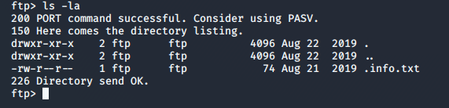

Для того, чтобы мы могли получить `.info.txt` необходимо использовать Passive mode FTP.
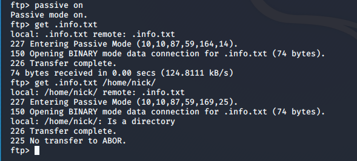

Прочитав данный файл мы получаем - `Whfg jnagrq gb frr vs lbh svaq vg. Yby. Erzrzore: Rahzrengvba vf gur xrl!`, сразу идем декриптить это в любой сайт для дешифрования. Я использую [этот](https://www.boxentriq.com/code-breaking/cipher-identifier). 
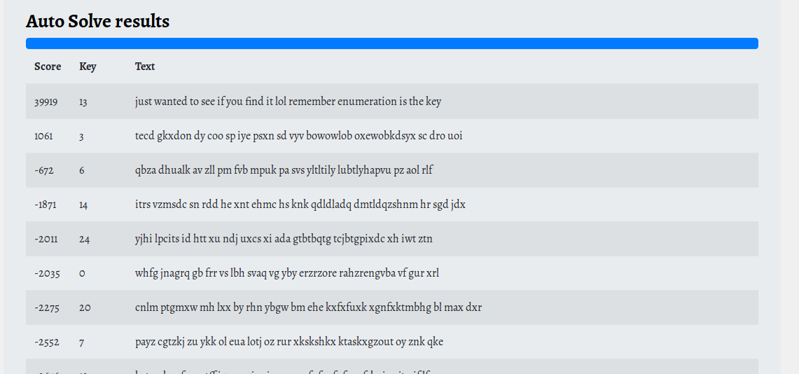
Так же на сайте имееются еще пару шифров, которые не имеют значения к решению. 

<details>
  <summary>Пример</summary>

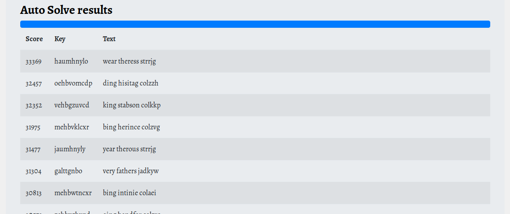
------------------------------------
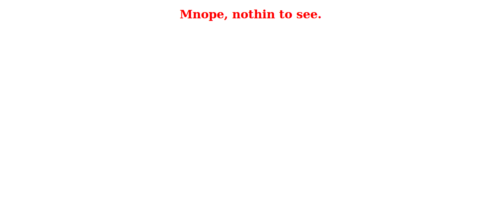
------------------------------------
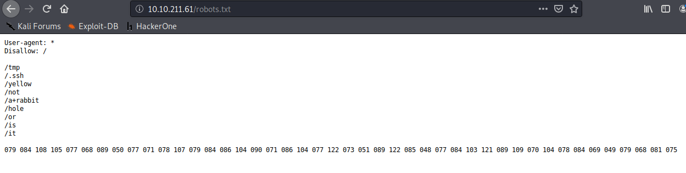
------------------------------------
</details> 


Когда мы использовали тулзу `dirb` он обнаружил интересный линк - `http://10.10.87.59/joomla/_test/`
Видим, что используется `sar2html`. Более подробно про него можно прочитать [тут](https://sourceforge.net/projects/sar2html/)

Уязвимость заключается в этом веб-интерфейсе, в параметре `plot=NEW`

 

Попробуем вставить туда команду `ls` и посмотрим, что нам покажет. Более подробнее [exploit](https://www.nmmapper.com/st/exploitdetails/47204/41579/sar2html-321-remote-command-execution/) 

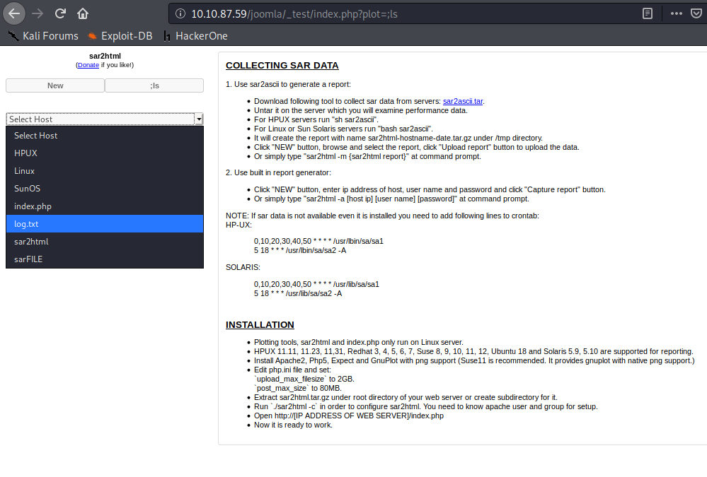

Дальше выполним команду `cat log.txt` и увидим пароль и юзера от ssh   `superduperp@$$:basterd`

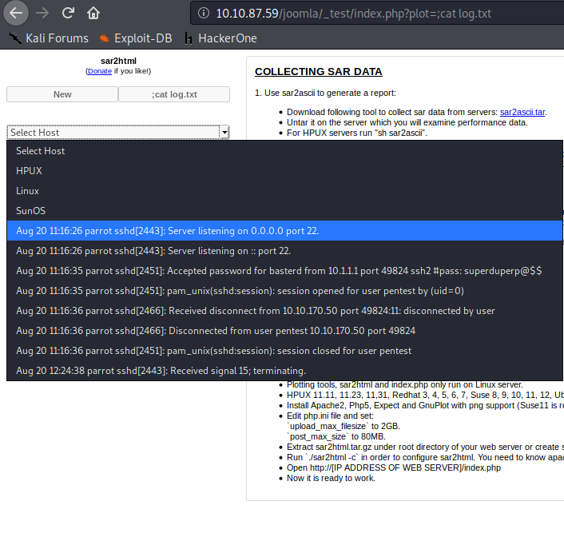

Коннектимся по ssh и заходим на машину `ssh basterd@10.10.87.59 -p 55007` 

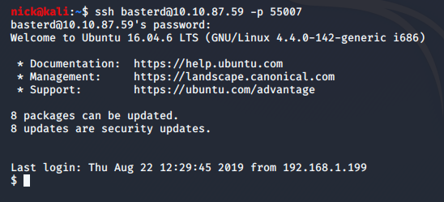
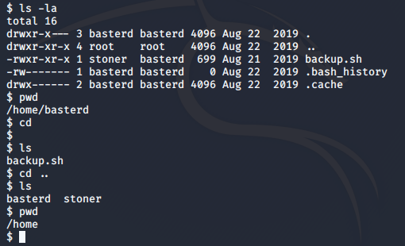

Копируем файл [backup.sh](./backup.sh) себе на машину для дальнейшего изучения `scp -P 55007 basterd@10.10.87.59:/home/basterd/backup.sh /home/nick/file/`.
В нем узнаем пароль от пользователя `stoner:superduperp@$$no1knows`
## User flag
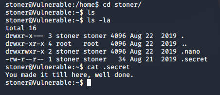

